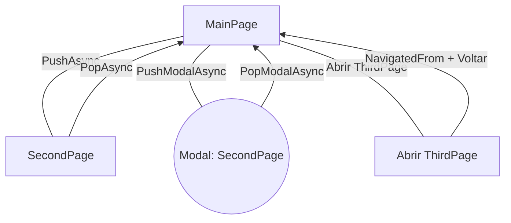

# 📘 Projeto de Demonstração – Ciclo de Vida e Navegação em Páginas (.NET MAUI)

## Este projeto foi criado com fins educacionais para auxiliar alunos do curso de Desenvolvimento de Sistemas a compreender:

  1. O ciclo de vida das páginas

  2. O funcionamento da pilha de navegação

  3. A diferença entre PushAsync, PopAsync, PushModalAsync e PopModalAsync

  4. O uso de NavigatedTo e NavigatedFrom

  5. A comunicação entre páginas com MessagingCenter

  6. O registro visual de eventos na interface

---

---

# 🎯 Objetivo do Projeto

## Demonstrar de forma prática como o .NET MAUI gerencia:

  * Navegação entre telas

  * Ciclo de vida das páginas

  * Eventos globais de navegação modal

  * Registro visual de todos os eventos no log da MainPage

  * Comunicação entre páginas usando MessagingCenter

  * O aluno pode visualizar, na prática, quais eventos são disparados em cada tipo de navegação.

---

# 📌 Principais Funcionalidades

    ✔ Navegação tradicional (PushAsync / PopAsync)
    ✔ Navegação modal (PushModalAsync / PopModalAsync)
    ✔ Página com NavigatedTo e NavigatedFrom
    ✔ Log completo exibido em tempo real (ObservableCollection)
    ✔ Eventos globais do App (ModalPushing, ModalPushed, etc.)
    ✔ Comunicação entre páginas usando MessagingCenter
    ✔ Botões dedicados para cada ação didática
    ✔ Projeto ideal para demonstrar pilha de navegação e ciclo de vida

---

# 🧭 Resumo da Navegação de Páginas no MAUI

## A navegação funciona de duas formas principais:

---

## 🔹 1. Navegação com Navigation Stack

    PushAsync(page) → coloca a página no topo da pilha

    PopAsync() → remove a página do topo

### Funciona como uma pilha de pratos:

### O último que entra é o primeiro que sai.

---

## 🔹 2. Navegação Modal

    PushModalAsync(page) → abre uma página por cima das outras

    PopModalAsync() → fecha o modal atual

### Uma página modal funciona como:

  ### "Uma janela obrigatória" que deve ser fechada antes de retornar à aplicação.

---

## 🔹 3. Navegação com eventos modernos

### A ThirdPage demonstra:

    OnNavigatedTo → quando a página passa a ser exibida

    OnNavigatedFrom → quando o usuário navega para outra página

### Esses eventos são úteis para:

  * carregar dados parar timers

  * atualizar o estado da interface

  * registrar navegação

---

# 📱 Páginas do Projeto
  ## MainPage

  * Centraliza os logs de eventos

  * Possui botões para todos os tipos de navegação

  * Assina mensagens enviadas pela SecondPage e ThirdPage

  ## SecondPage

* Demonstra Appearing e Disappearing

8 Envia mensagens para a MainPage

* Possui botões de retorno via:

    * PopAsync

    * PopModalAsync
 
## ThirdPage

  * Demonstra:

    * NavigatedTo

    * NavigatedFrom

  * Possui botão para retornar à página anterior

---

# 🎓 Finalidade Educacional

## Este projeto foi pensado para:

  * Aulas práticas de MAUI

  * Cursos de desenvolvimento mobile

  * Demonstração de eventos de ciclo de vida

  * Estudos sobre comportamento de navegação

Ideal para professores e alunos que precisam visualizar o que realmente acontece por trás das telas.

---
